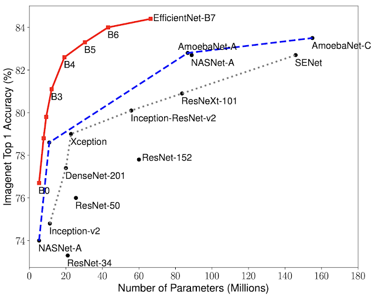
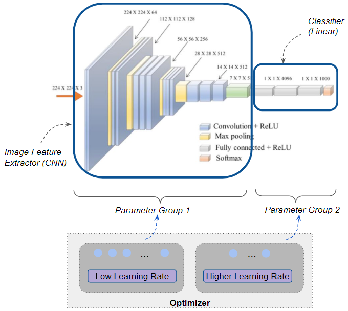

# 102 Flowers Challenge on ResNet34
<a href="https://www.robots.ox.ac.uk/~vgg/publications/papers/nilsback08.pdf">Official Paper</a>&emsp;<a href="https://www.robots.ox.ac.uk/~vgg/data/flowers/102/">Official Page</a>&emsp;<a href="https://s3.amazonaws.com/fast-ai-imageclas/oxford-102-flowers.tgz">Download Dataset</a>&emsp;<a href="https://gist.github.com/JosephKJ/94c7728ed1a8e0cd87fe6a029769cde1">Download Labels</a>

---
#### Project Description
Although the idea of Deep Learning was born almost 80 years ago, we are just given the opportunity to bring any sophisticated ideas to life. That is why we will be looking 
at the extensively researched case of classfying <a href="https://www.robots.ox.ac.uk/~vgg/publications/papers/nilsback08.pdf">102 categories of flowers</a>. 
Even though the task does not sound hard, the challenges arise in the similarity in both color and shape.

  
To give an example of similarities, there are nine types of lilies (Giant White Arum, Fire, Water, Toad, Blackberry, Sword, Tiger, Peruvian, Canna) and two types of 
irises (Bearded and Yellow). Additional difficulties can be found with the non-conventional distribution of training (12.45%), validation (12.45%), and testing (75.1%) sets.
The project will be worked with <a href="https://arxiv.org/abs/1512.03385">ResNet34</a> pre-trained model (a residual network that was trained on ImageNet's images).
It is considerately smaller than most of the other models with only 20 million parameters. Thus, the training part will not take long even on CPU mode 
(from my findings, running 15 epochs takes around 40 minutes). 
 

---

The notebook contains experimentations with different model instantiations, in particular, various optimizers. 
There are three of them used: Stochastic Gradient Descent (Nesterov's Accelerated Gradients), Adagrad and Adam. It's challenging to find the correct optimizers, 
so I wanted to see the actual differences in prediction before settling with a specific one. In addition to these experimentations, fellowship.ai's requirement was to use 
Discriminative Learning Rates. Thus, all models were trained using that technique along with Exponential Learning Decay Scheduler to boost accuracy. 

To better understand how Discriminative Learning Rates work, the following image might help (right). 
To implement this technique, we need to use smaller learning rates at convolutional layers and bigger ones in the fully-connected ones. Doing so boosted the performance. 
I specifically want to focus on the case of Adagrad. At the beginning, I've trained it using 
<a href="https://pytorch.org/docs/stable/generated/torch.optim.lr_scheduler.ExponentialLR.html#torch.optim.lr_scheduler.ExponentialLR">Exponential Learning Decay Scheduler</a>. 
By doing so, only **depressing** 23% of the images were correctly classified. However, by changing per-layer learning rates resulted in 61% performance improvement! 

The overall accuracy of each model is over 80%, with the best ones (SGD and Adam) scoring 87%. However, there is the fifth model that has more transformations, which had a 100%
confidence on classifying the never-seen-before image of a sunflower. 
